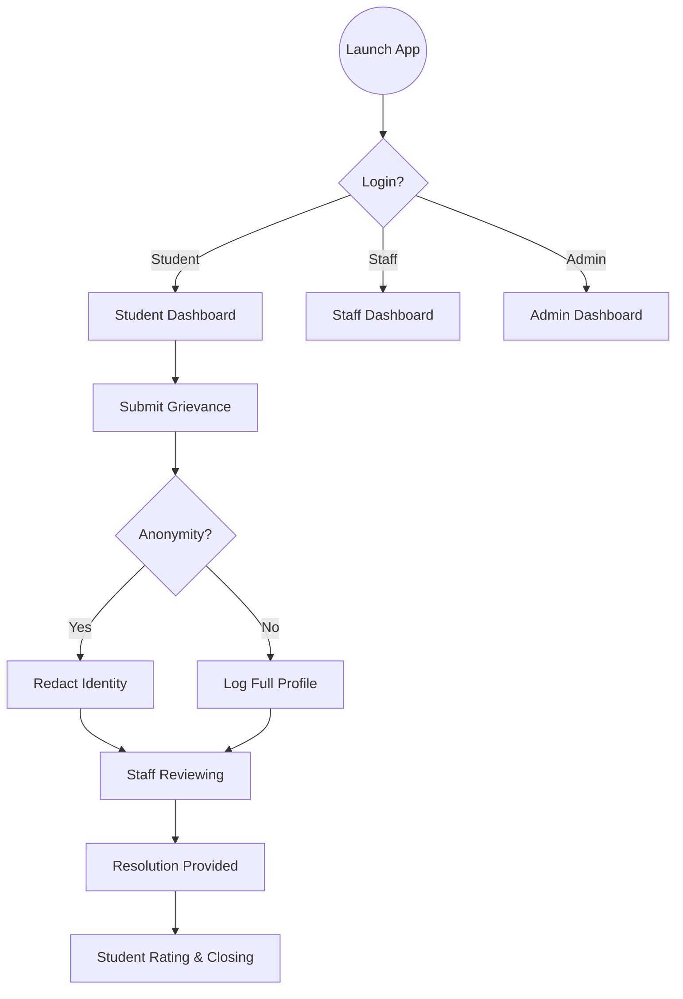
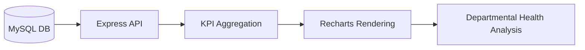

# 🏛️ Student Grievance Management System

<p align="center">
  
</p>

<p align="center">
  <b>Elevating Academic Transparency through Modern Engineering.</b><br>
  Built with React 19, Express, and a custom 'Pastel Glow' Design System.
</p>

---

## 🌟 Vision & Purpose
The **Student Grievance Management System** is a full-stack institutional solution designed to bridge the communication gap between students and administration. By providing a centralized, secure, and transparent platform, we ensure that every student's concern is heard, tracked, and resolved with professional accountability.

### 🎨 Design Philosophy: 'Pastel Glow'
Our UI isn't just functional; it's an experience.
- **Calm Palette**: Uses soft oranges, lavenders, and peaches to reduce "grievance anxiety."
- **Hand-Drawn Aesthetic**: Featuring custom, hand-sketched icons that provide a human, approachable touch to a formal process.
- **Glassmorphism**: Subtle backdrop blurs and translucent layers for a modern, high-end SaaS feel.

---

## 🚀 Interactive Features

### 👤 Student Experience
- **Anonymity Shield**: Toggle high-level privacy for sensitive reports.
- **Live Tracking**: Visual timeline of grievance status from 'Pending' to 'Resolved.'
- **Help Center**: Integrated FAQ system and direct mail vectors to staff.
- **Feedback Loop**: Rate resolutions and provide sentiment feedback to improve system quality.

### 👮 Staff & Administrative Oversight
- **Real-Time Analytics**: High-level heatmaps of department performance and grievance categories.
- **Audit Logs**: Every status change is timestamped and attributed, creating a perfect chain of accountability.
- **Departmental Logic**: Intelligent routing of grievances to specific faculty heads.
- **Privacy Controls**: Admin-level oversight with strict data redaction for anonymous filings.

---

## 🛠️ Technical Architecture

### 💻 Enterprise-Grade Stack
| Layer | Technology |
| :--- | :--- |
| **Frontend** | React 19 (Latest), TypeScript, Vite 6 |
| **Styling** | Tailwind CSS 4, Framer Motion (Animations) |
| **Charts** | Recharts (SVG-based dynamic data viz) |
| **Backend** | Node.js, Express (REST API) |
| **Database** | MySQL (Pool-based persistent storage) |
| **Security** | JWT (Stateless Auth), Bcrypt (Password Hashing) |

### 📂 Project Structure
```text
├── src/
│   ├── components/       # Reusable UI & Layout components
│   │   ├── ui/           # Atomic components (Buttons, Inputs, Logo)
│   ├── layouts/          # Dashboard & Auth layout wrappers
│   ├── pages/            # View logic (Student, Staff, Admin views)
│   ├── context/          # State management (AuthContext)
│   └── icons/            # Hand-drawn SVG library
├── server.ts             # Express REST API & Vite dev middleware
├── render.yaml           # Infrastructure-as-Code for Render
├── vercel.json           # Serverless config for Vercel
└── README.md             # This definitive guide
```

---

## 🗺️ System Logic (Flowcharts)

### **Grievance Lifecycle**


### **Administrative Analytics Pipeline**


---

## 📦 Zero-Config Installation

### 1. Repository Setup
```bash
git clone https://github.com/tonyboss365/Student-Grivence-Management.git
cd Student-Grivence-Management
npm install
```

### 2. Database Provisioning
Ensure MySQL is running and create a `.env` file:
```env
DB_HOST=localhost
DB_USER=root
DB_PASSWORD=your_password
DB_NAME=grievance_db
JWT_SECRET=production_grade_secret_key
```

### 4. Run Development Server
```bash
npm run dev
```

---

## 🆘 Troubleshooting: "Unexpected Token A" Error

If you see a red error box saying **"Unexpected token 'A'..."**, it means your local server cannot connect to your database. 

### **How to Fix it in 1 Minute:**
1. **Rename the Template**: Find the file `.env.example` in this folder and rename it to exactly `.env`.
2. **Auto-Configured**: I have already pre-filled the `.env.example` with your **TiDB Cloud** credentials! Once renamed, it will work instantly.
3. **Restart the Server**: Close your terminal and run `npm run dev` again.

> [!TIP]
> **No Local MySQL?** No problem! By putting your TiDB Cloud credentials into your local `.env` file, you can test the app on your own computer while using the cloud database in Singapore.

---

## 🏁 Automated Deployment

- **Render (Recommended)**: Use the `render.yaml` Blueprint. It creates your Web Service and Managed MySQL Database automatically in one click.
- **Vercel**: Optimized for static frontend hosting with `/api` serverless rewrites.

---

## 👥 The Development Team
**K L Deemed to be University**

| Name | Student ID | Contact |
| :--- | :--- | :--- |
| **Akshay** | 2420030604 | `akshay.2420030604@klh.edu.in` |
| **Bhuvan** | 2420030135 | `bhuvan.2420030135@klh.edu.in` |
| **Girish** | 2420030031 | `girish.2420030031@klh.edu.in` |
| **Eshwar M** | 2420030644 | `eshwar.2420030644@klh.edu.in` |

---

*© 2026 Student Grievance System. Redefining accountability in education.*
