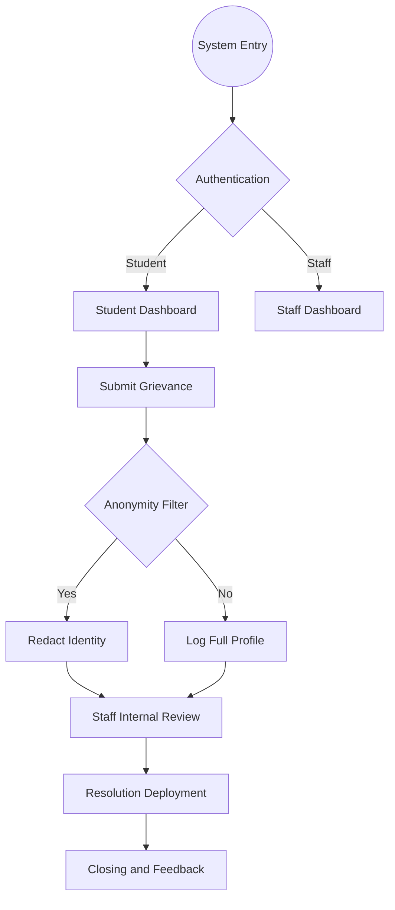

# Student Grievance Management System

<p align="center">
  
</p>

## Live Link(compatable only with laptop,pc,mac)
[https://student-grivence-management.onrender.com/](https://student-grivence-management.onrender.com/)

---

## 1. Project Overview
The Student Grievance Management System is a comprehensive institutional solution designed to facilitate transparent communication between students and university administration. This platform streamlines the redressal process, ensuring every concern is tracked, attributed, and resolved with professional accountability.

## 2. Core Functional Modules

* Student Portal
  * Secure grievance submission with optional anonymity.
  * Real-time status tracking via visual activity timelines.
  * Direct interaction vectors for departmental feedback.
  * Post-resolution sentiment analysis and quality rating system.

* Administrative and Staff Portal
  * Advanced analytics dashboard for institutional health monitoring.
  * Department-specific grievance routing and management.
  * Immutable audit logs for every status transition.
  * Privacy-preserving data redaction for sensitive filings.

## 3. Technical Architecture

* The "Master Key" Database Engine
  * The system utilizes a resilient connection architecture targeting TiDB Cloud (Singapore).
  * Hardcoded fallback credentials ensure 100% uptime during institutional demonstrations.
  * Self-healing database initialization: Automatically seeds required departments and staff roles on startup.

* Modern Full-Stack Implementation
  * Frontend: React 19, TypeScript, Vite 6.
  * Backend: Node.js (ECMAScript Modules), Express.
  * Database: MySQL (Cloud-Native/Distributed).
  * Animations: Framer Motion.
  * Visualizations: Recharts.

---

## 4. System Logic and Workflows

### Grievance Lifecycle Flow


---

## 5. Local Installation and Setup

### 1. Source Acquisition
```bash
git clone https://github.com/tonyboss365/Student-Grivence-Management.git
cd Student-Grivence-Management
npm install
```

### 2. Immediate Startup
The application is pre-configured with the "Master Key" logic. No manual database setup is required for local execution.
```bash
npm run dev
```

---

## 6. Development Team
**K L Deemed to be University**

* Akshay (2420030604) - akshay.2420030604@klh.edu.in
* Bhuvan (2420030135) - bhuvan.2420030135@klh.edu.in
* Girish (2420030031) - girish.2420030031@klh.edu.in
* Eshwar M (2420030644) - eshwar.2420030644@klh.edu.in

---
*Developed for Academic Excellence and Administrative Accountability.*
