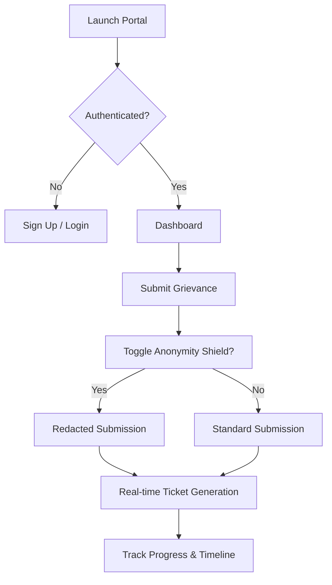
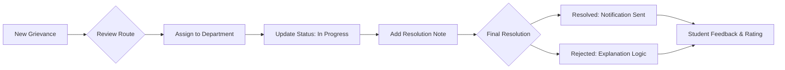

# 🏛️ Student Grievance Management System


> **A better way to resolve grievances. Transparent, efficient, and fair.**
> Built with a boutique **'Pastel Glow'** aesthetic and institutional-grade security.

---

## 🌟 Vision & Purpose
The Student Grievance Management System was born from a need for radical transparency in academic administration. No more lost emails or ignored complaints. Every voice is tracked, every issue is logged, and every resolution is finalized.

### 🎨 Key Aesthetics
- **Pastel Glow Palette**: Curated warm tones (Orange, Lavender, Peach) for a premium, inviting feel.
- **Hand-Drawn Iconography**: Custom hand-drawn aesthetic icons (inspired by Claude) for a human-centric experience.
- **Anonymity Shield**: A privacy-first approach allowing students to report sensitive issues securely.

---

## 🛠️ Technological Foundation

### **Core Stack**
- **Frontend**: React 19 + TypeScript + Vite
- **Styling**: Tailwind CSS + Framer Motion (Transitions)
- **Visuals**: Recharts (Dynamic Analytics)
- **Backend**: Node.js + Express
- **Database**: MySQL (Persistent Storage)
- **Security**: JWT Authentication + Bcrypt Hashing

---

## 🗺️ Architectural Flowcharts

### 👤 Student Workflow


### 👮 Staff & Admin Resolution


---

## 🚀 Features at a Glance

### **For Students**
- **Interactive Dashboards**: Real-time monitoring of active tickets.
- **Help Center**: Interactive FAQ and direct 'Mail to Staff' integration.
- **Secure Profiles**: Manage identity and notification preferences.

### **For Staff & Admin**
- **Advanced Analytics**: Breakdown of resolution rates, department health, and satisfaction scores.
- **System Oversight**: Holistic view of all institutional pain points.
- **Grievance Lifecycle**: Complete audit trail (Logs) for transparency.

---

## 📦 Local Installation & Setup

1. **Clone the project**:
   ```bash
   git clone https://github.com/tonyboss365/Student-Grivence-Management.git
   ```

2. **Install Dependencies**:
   ```bash
   npm install
   ```

3. **Configure Environment**:
   Create a `.env` file in the root:
   ```env
   DB_HOST=localhost
   DB_USER=root
   DB_PASSWORD=your_password
   DB_NAME=grievance_db
   JWT_SECRET=supersecretkey
   ```

4. **Run Development Server**:
   ```bash
   npm run dev
   ```

---

## 🏁 Deployment (Render & Vercel)

This project is optimized for both **Render** and **Vercel**. 
- **Vercel**: Use the provided `vercel.json` for serverless deployment.
- **Render**: Use the `render.yaml` for managed MySQL and Web Service orchestration.

---

## 👥 Development Team
- **Akshay** (2420030604@klh.edu.in)
- **Bhuvan** (2420030135@klh.edu.in)
- **Girish** (2420030031@klh.edu.in)
- **Eshwar M** (2420030644@klh.edu.in)

---

*© 2026 Student Grievance System. Built with passion for better administration.*
