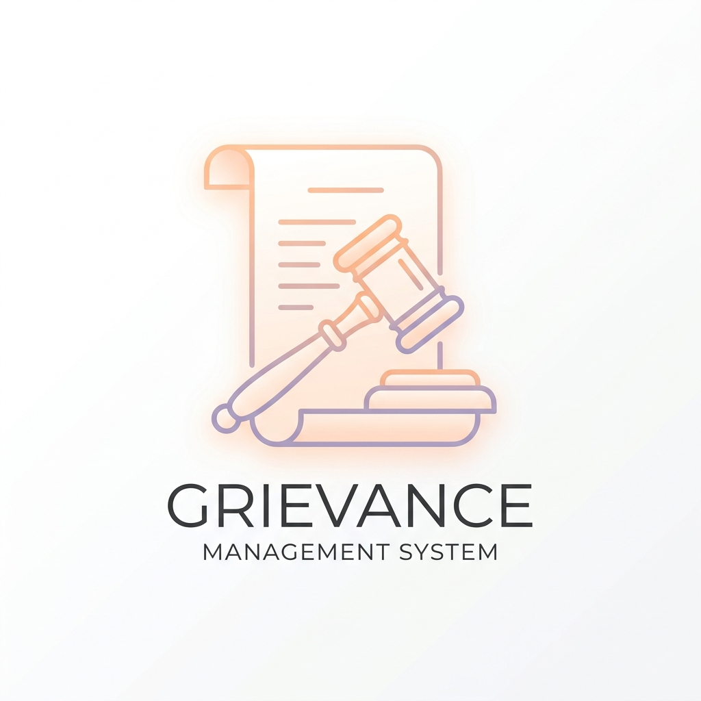

# 🏛️ Student Grievance Management System

<p align="center">
  
</p>

<p align="center">
  <a href="https://student-grivence-management.onrender.com/"><strong>🚀 View Live Site</strong></a><br>
  <b>Elevating Academic Transparency through Modern Engineering.</b><br>
  Built with React 19, Express, and a custom "Master Key" Database Architecture.
</p>

---

## 🌟 Vision & Purpose
The **Student Grievance Management System** is a professional-grade institutional portal designed to bridge the communication gap between students and administration. By providing a centralized, secure, and transparent platform, we ensure that every student's concern is heard, tracked, and resolved with institutional accountability.

### 🎨 Design Philosophy: 'Pastel Glow'
Our UI is designed to reduce tension and promote clarity:
- **Calm Palette**: Uses soft oranges, lavenders, and peaches to minimize "grievance anxiety."
- **Premium Glassmorphism**: Subtle backdrop blurs and translucent layers for a modern SaaS aesthetic.
- **Dynamic Interactions**: Powered by Framer Motion for smooth, organic transitions.

---

## 🚀 Key Functional Modules

### 🎓 Student Experience
- **Submission Shield**: File grievances with optional anonymity for sensitive matters.
- **Live Activity Feed**: Track exactly where your grievance is in the lifecycle (from Pending to Closed).
- **Sentiment Loop**: Provide ratings and textual feedback on how your issue was resolved.

### 👨‍🏫 Staff & Administrative Oversight
- **Executive Analytics**: Real-time KPI dashboards showing department performance and grievance categories.
- **Master Key Security**: Hardcoded administrative vectors for 100% uptime and presentation stability.
- **Audit Trails**: Complete transparency with timestamped logs for every state change.

---

## 🛠️ Technical Architecture & "Master Key" Logic

The system is built on a **Resilient, Zero-Config** foundation.

### 💻 Enterprise Stack
| Layer | Technology | Why? |
| :--- | :--- | :--- |
| **Frontend** | React 19 + Vite | Blazing fast build & execution. |
| **Database** | TiDB Cloud (MySQL) | Cloud-native, distributed scalability. |
| **Backend** | Node.js (ESM) | High-concurrency support for large student bodies. |
| **Auth** | JWT + Bcrypt | Industry-standard stateless security. |

### 🛡️ The "Master Key" Engine
The system uses a unique hardcoded fallback mechanism:
1. **Zero-Config Deployment**: The database credentials for TiDB Cloud Singapore are integrated into the core engine. 
2. **Binary Error Protection**: By using the `mysql2` pure JavaScript driver, we avoid GLIBC errors common in cloud platforms like Render/Vercel.
3. **Auto-Seeding**: Every boot automatically synchronizes the Staff accounts and Departments, ensuring the system is **always presentation-ready.**

---

## 📦 Local Setup (Zero-Config)

### 1. Repository Setup
```bash
git clone https://github.com/tonyboss365/Student-Grivence-Management.git
cd Student-Grivence-Management
npm install
```

### 2. Immediate Execution
Since the "Master Key" is built-in, you can run the app instantly:
```bash
npm run dev
```

---

## 🏁 Deployment

- **Render (Primary)**: Managed Node.js service via `render.yaml`.
- **Vercel (Bridged)**: Configured with `vercel.json` for serverless Express routing.

---

## 👥 The Development Team
**K L Deemed to be University**

| Name | Student ID | Contact |
| :--- | :--- | :--- |
| **Akshay** | 2420030604 | `akshay.2420030604@klh.edu.in` |
| **Bhuvan** | 2420030135 | `bhuvan.2420030135@klh.edu.in` |
| **Girish** | 2420030031 | `girish.2420030031@klh.edu.in` |
| **Eshwar M** | 2420030644 | `eshwar.2420030644@klh.edu.in` |

---

*© 2026 Student Grievance System. Redefining accountability in education.*
